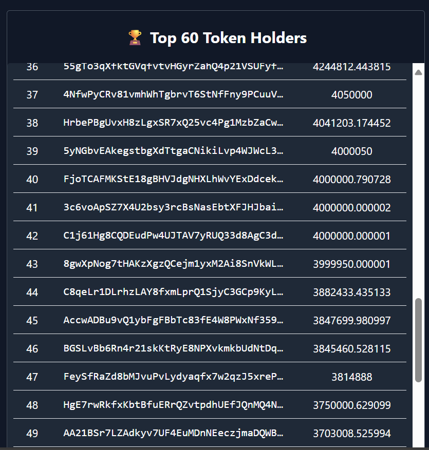
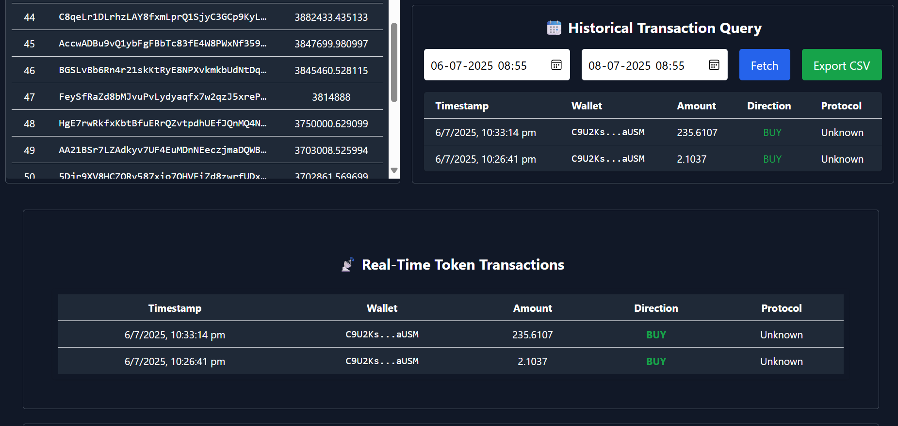
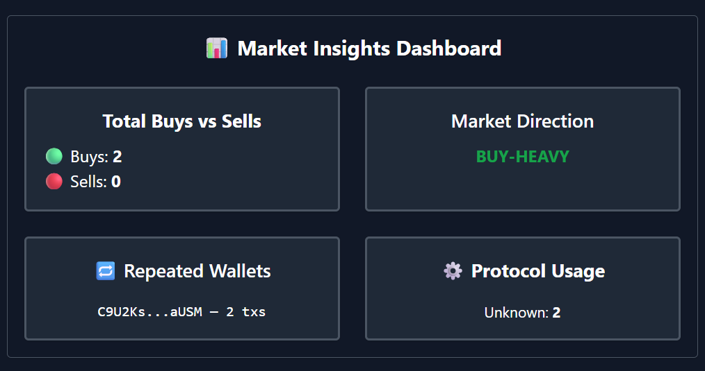

# 🧠 TokenWise — Real-Time Wallet Intelligence on Solana

## 📘 Description

**TokenWise** is a real-time analytics platform that tracks and visualizes token transactions on the Solana blockchain. It focuses on the top 60 holders of a target token, capturing and displaying their real-time activity, protocol usage, and historical trends through a React dashboard. It’s designed for traders, analysts, and developers seeking on-chain intelligence.

---

## 🛠️ Installation

### 1. Clone the Repository

```bash
git clone https://github.com/your-username/tokenwise.git
cd tokenwise
```

### 2. Backend Setup

```bash
cd backend
npm install
```

Create a `.env` file with:

```env
MONGO_URI=your_mongodb_connection_string
HELIUS_API_KEY=your_helius_api_key
PORT=3001
```

Run the server:

```bash
node app.js
```

### 3. Frontend Setup

```bash
cd ../frontend
npm install
npm run dev
```

---

## 🚀 Usage

- Backend:
  - Fetches top 60 token holders using Helius API
  - Listens to real-time transactions with WebSocket via Solana RPC
  - Filters for top-holder activity and broadcasts via WebSocket
  - Stores relevant transactions in MongoDB

- Frontend:
  - Displays real-time transaction feed
  - Shows top holders table
  - Dashboard with insights and protocol stats
  - Historical query + export feature

---

## ✨ Features

- 🔁 Live buy/sell transaction stream
- 🧠 Focus on top 60 token holders
- 📊 Dashboard with:
  - Buys vs Sells
  - Net Direction
  - Protocol Usage
  - Repeated Wallet Activity
- 📡 WebSocket-based live updates
- 📦 Export transaction reports (CSV/JSON)
- 🌐 Built with React + Tailwind CSS

---

## 📸 Screenshots

> Add your screenshots in `/screenshots` folder and update paths.

| Top Holders Table | Real-Time Feed | Dashboard |
|-------------------|----------------|------------|
|  |  |  |

---

## 🤝 Contributing

Contributions are welcome!

```bash
1. Fork the repository
2. Create your feature branch (git checkout -b feature/AmazingFeature)
3. Commit your changes (git commit -m 'Add some feature')
4. Push to the branch (git push origin feature/AmazingFeature)
5. Open a pull request
```

---

## 📄 License

This project is licensed under the MIT License.

---

## 📬 Contact

Created by **Atul Singh**  
- GitHub: [@AtulSingh-7](http://github.com/AtulSingh-7)  
- LinkedIn: [linkedin.com/in/your-profile](https://www.linkedin.com/in/atul-singh-96b86528b/)  
- Email: atulnara5@gmail.com

---
